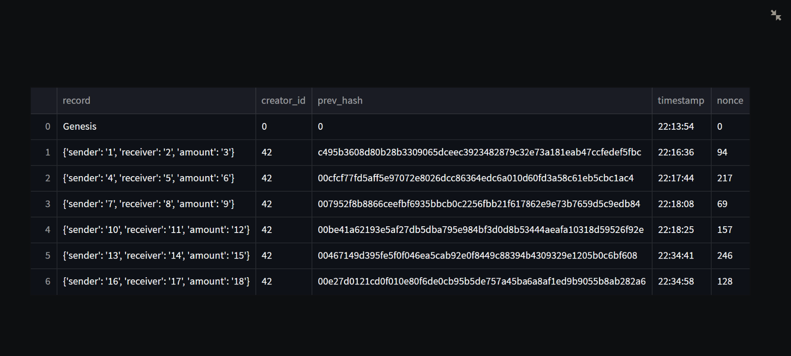
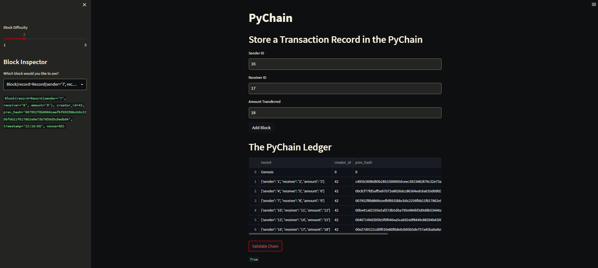

# 18th_Challenge
Note: there was no 16th or 17th challenge because my 2nd group project took place of 2 challenges. If you also factor in my 1st group project taking the place of 2 more challenges, this is technically my 14th challenge because 18 - (2+2) = 14. I just called it "18th_Challenge" for convenience based on the structure of the coding cource I took.

## Summary of Purpose  

I created a basic block-chain that you can interact with through a Streamlit GUI (Graphical User Interface).

---

## Required/Compatible Technologies

If you just want to see an example chain in the GUI, look at the images below.
If you want to actually use the app, continue reading this section.

**Compatible OS's:** Mac, Windows, or Linux  
**Programming language:** Python (filetype: .py)  
**Required libraries/installations:**  

```
import streamlit as st
from dataclasses import dataclass
from typing import Any, List
import datetime as datetime
import pandas as pd
import hashlib
```

----
## How to Open the Code

You can view it on this github repository.  
You can also use a code editor that supports Python (.py files), e.g. VSCode.

## How to Open the Application

Open a terminal. "cd" into the folder containing the "pychain.py" file.
Run the following command:
`streamlit run pychain.py`

To shutdown the app, go to your terminal and press "Ctrl+C".

---

## Contributors

Noah Saleh

email: noahgsaleh@gmail.com

---

### Image of Complete Chain History

Note: the second block's previous hash doesn't start with two zero's because it's the hash of the Genesis block. The Genesis block was manually added to the chain with a set nonce (the nonce was 0 in this case), so it didn't have to go through the proof-of-work function (the function that tests nonces until the hash starts with "00"). The nonce for the Genesis block was "unlucky" and did not produce a hash with "00" at the start. This doesn't affect the security/functionality of the chain since this exception only happens with the Genesis block.

  


### Image of the Whole App (you can see the sidebar & the validation functionalities)

  